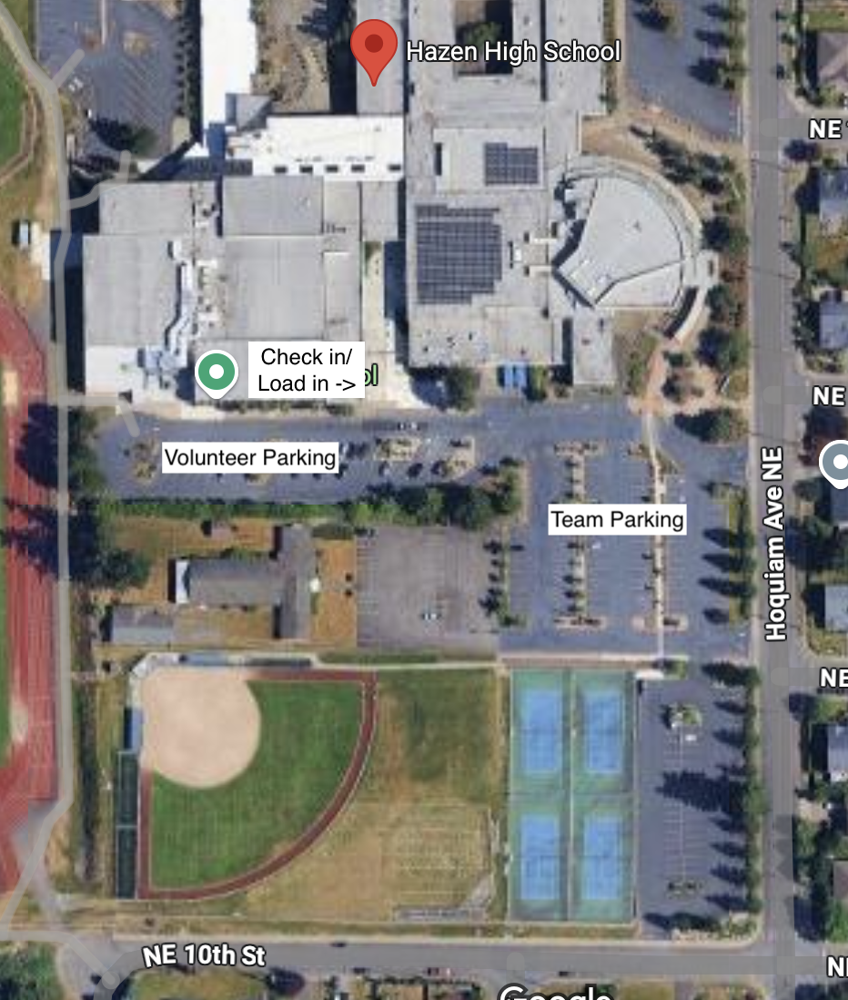
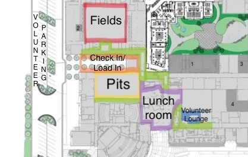

 
 

# About WCI

The 2026 West Coast Invitational will happen tentatively on June 6th - 7th, 2026, from 8am - 6pm, at [Foss High School](https://www.google.com/maps/place/Hazen+High+School/@47.501618,-122.155454,16z/data=!3m1!4b1!4m6!3m5!1s0x5490687dc4a82d11:0xe78cca4c59118161!8m2!3d47.501618!4d-122.1528791!16s%2Fm%2F027w3dj?entry=ttu&g_ep=EgoyMDI1MDIxMi4wIKXMDSoASAFQAw%3D%3D) (2112 South Tyler Street, Tacoma, WA 98405)
<iframe src="https://www.google.com/maps/embed?pb=!1m18!1m12!1m3!1d2708.824933668929!2d-122.4988878238755!3d47.23957017115851!2m3!1f0!2f0!3f0!3m2!1i1024!2i768!4f13.1!3m3!1m2!1s0x54905533679a918f%3A0x9a239925249f92ad!2sFoss%20High%20School!5e0!3m2!1sen!2sus!4v1769531532401!5m2!1sen!2sus" width="600" height="450" style="border:0;" allowfullscreen="" loading="lazy" referrerpolicy="no-referrer-when-downgrade"></iframe>

## Venue & Parking Information

- **Parking Information:** Parking is available on site at Foss High School's parking lot.
- **Arrival Time:** See the [schedule below](about.md#schedule).

[//]: # (
)
[//]: # (  )
[//]: # (  )
[//]: # (
)

## Schedule
- Our current (tentative) schedule for the event can be found below.
- We will be running one field this year (along with a practice field)
- Please note that the **times listed below are only estimates** and are subject to delay.

| Time                       | What                                |
|:---------------------------|:------------------------------------|
| **Day 1 (June 6th, 2026)** |                                     |
| 7:30 AM to 8:00 AM         | Volunteers Arrive                   |
| 8:30 AM                    | Venue Opens                         |
| 8:30 AM to 9:30 AM         | Team Check-in                       |
| 9:00 AM to 10:30 AM        | Team Robot Inspection               |
| 9:30 AM to 10:30 AM        | Practice Matches                    |
| 10:45 AM to 11:30 AM       | Opening Ceremonies/Driver's Meeting |
| 11:30 AM to 12:00 PM       | Qualification Matches               |
| 12:00 PM to 12:45 PM       | Lunch                               |
| 12:45 PM to 3:45 PM        | Qualification Matches               |
| 4:00 PM to 4:15 PM         | Alliance Selection                  |
| 4:30 PM to 6:00 PM         | Playoff Matches                     |
| 6:05 PM to 6:15 PM         | Closing Ceremonies                  |
| 6:30 PM                    | Venue Closes                        |
| 6:30 PM to 7:30 PM         | Teardown                            |

## Format
- The event will follow standard 2026 DECODE season format, with a double elimination bracket.
- There will be qualification matches, alliance selection, eliminations, and awards at the end (see [schedule](about.md#schedule) for more detail).

## Payment
Payment is only $25 USD per team, based on a **first come, first served policy**. Additionally, you can pay additional increments of $25 to compete with additional robots.
- Teams will receive information regarding how to pay after registration via email.
- We will **never** ask you for your credit card information in Discord, email, phone call, or other means.
  - All payments will be made through a secure payment processor (Stripe).//